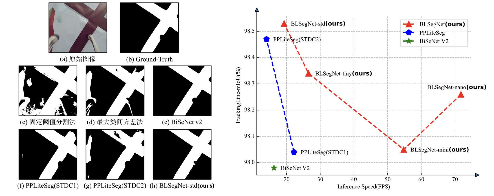
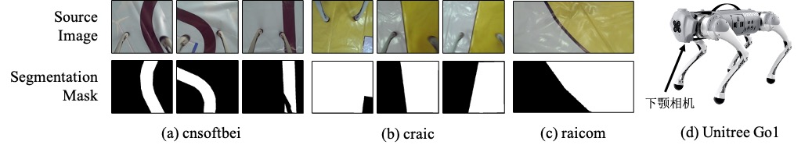

# BLSegNet

<div align="center"></div><br>

## 项目简介

路径分割是工业巡检任务中关键的基础性工作。针对当前路径分割算法难以在智能机器人平台上实现推理速度与分割精度之间平衡的问题，提出了一种轻量级路径分割网络——分块线性分割网络（BLSegNet），同时提出随机光斑图像增广策略处理光照分布多样性问题，并公开了首个应用于智能机器人巡检的路径分割数据集TrackingLine。实验结果表明，该网络在维持路径分割精度的基础上，能够大幅度提升计算速度。

<div align="center"></div>


## TrackingLine数据集
<details>
<summary>数据集简介</summary>

TrackingLine路径分割数据集共有三个子场景，分别来自第十二届“中国软件杯”大学生软件设计大赛智能四足机器狗电力巡检系统开发赛道(cnsoftbei)、第二十五届中国机器人及人工智能大赛机器人应用赛四足极速物流赛道(craic)和2023睿抗机器人开发者大赛物资运送赛道(raicom)。三个子场景的细节对比如下表。

|场景|训练集样本数量|验证集样本数量|合计数量|路径类型|路径颜色|背景颜色|
|:---:|:---:|:---:|:---:|:---:|:---:|:---:|
|cnsoftbei|850|363|1213|窄，多曲线(大曲率)|黑色|白色，有不同颜色图案干扰|
|craic|500|214|714|宽、直线、直角弯|黄色|白色，无其他图案|
|raicom|1274|546|1820|宽，多曲线(小曲率)|黄色|白色，无其他图案|

我们使用宇树科技Go1四足机器人的下颚相机进行数据采集，标注后以7:3的比例将数据集划分为训练集和验证集，并以MS-COCO格式保存。三个子场景样例见下图。



</details>

<details>
<summary id="datasetdownload">下载数据集</summary>

你可以从[ModelScope](https://modelscope.cn/datasets/CoderAN/TrackingLine/)平台通过Git免费获取数据集。

首先，安装`git-lfs`.

```sh
curl -s https://packagecloud.io/install/repositories/github/git-lfs/script.deb.sh | sudo bash
sudo apt update
sudo apt install git-lfs   
sudo git lfs install  --system
```

随后，在BLSegNet的工作目录下载TrackingLine。

```sh
cd BLSegNet
git clone https://www.modelscope.cn/datasets/CoderAN/TrackingLine.git ./datasets
```

</details>

<details>
<summary>数据集组织结构</summary>

由[ModelScope](https://modelscope.cn/datasets/CoderAN/TrackingLine/)下载TrackingLine后，你将得到如下目录组织结构。

```sh
datasets
    |- cnsoftbei              # 中国软件杯场景
    |   |- Images             # 采集的图像
    |   |   |- 00092.jpg
    |   |   |- 00096.jpg
    |   |   |- 00100.jpg
    |   |   |- ...
    |   |
    |   |- train.json         # 训练集标注(MS-COCO格式)
    |   |- val.json           # 验证集标注(MS-COCO格式)
    |
    |- craic                  # 人工智能大赛场景
    |- raicom                 # 睿抗大赛场景
```

</details>

## 快速启动
<details>
<summary id="quickstartinstallation">环境配置</summary>

* Step1. Setup your conda environment. ([What is Anaconda?](https://www.anaconda.com/download))
```sh
conda create -n blsegnet python=3.10 -y
conda activate blsegnet
```

* Step2. Install BLSegNet from source.
```sh
git clone https://github.com/BestAnHongjun/BLSegNet.git
cd BLSegNet
pip install -e .
```
</details>

<details>
<summary id="preparedataset">数据集准备</summary>

* Step1. 依照['*环境配置*'](#quickstartinstallation)部分创建conda环境，安装BLSegNet。

* Step2. 依照['*下载数据集*'](#datasetdownload)部分下载TrackingLine，然后你将看到如下目录结构。

```sh
BLSegNet
    |- datasets
    |   |- cnsoftbei
    |   |- craic
    |   |- raicom
    |   |- ...
    |
    |- assets
    |- exps
    |- blsegnet
    |- ...
```

</details>

<details>
<summary id="trainmodels">模型训练</summary>

* Step1. 依照['*环境配置*'](#quickstartinstallation)部分创建conda环境，安装BLSegNet。

* Step2. 依照['*下载数据集*'](#datasetdownload)部分下载TrackingLine。

* Step3. 在项目目录下分别运行如下命令，训练模型。

```sh
python tools/train.py -b 8 -f exps/cnsoftbei/blsegnet_nano_cnsoftbei.py
                                             blsegnet_mini_cnsoftbei.py
                                             blsegnet_tiny_cnsoftbei.py
                                             blsegnet_s_cnsoftbei.py
                                   craic/...
                                   raicom/...
```

> 参数说明: \
> **-b**: Batch Size. \
> **-f**: 指定实验配置文件. 

* Step4. 训练时开启随机光斑图像增广策略。

```sh
python tools/train.py -b 8 -f exps/cnsoftbei/blsegnet_nano_cnsoftbei_aug.py
                                             blsegnet_mini_cnsoftbei_aug.py
                                             blsegnet_tiny_cnsoftbei_aug.py
                                             blsegnet_s_cnsoftbei_aug.py
                                   craic/...
                                   raicom/...
```

* Step5. 训练结果会被保存至`BLSegNet_outputs`文件夹，可以通过运行`tensorboard`工具实时查看训练状态。

```sh
tensorboard --logdir=BLSegNet_outputs
```

</details>

<details>
<summary>演示示例(Demo)</summary>

运行如下指令，执行Demo。

```sh
python tools/demo.py image \
  -f exps/cnsoftbei/blsegnet_nano_cnsoftbei_aug.py \
  -c BLSegNet_outputs/blsegnet_nano_cnsoftbei_aug/best_ckpt.pth \
  --path datasets/cnsoftbei \
  --device gpu \
  --save_result
```

> 参数解释: \
> **--path**: 存放测试图片的文件夹. \
> **-f**: 指定实验文件. \
> **-c**: 指定权重文件. \
> **--device**: 指定使用`cpu`或`gpu`. \
> **--save_result**: 保存可视化图像至文件

**注意**: 如果你省略了`-c`选项，程序将默认使用'*BLSegNet_outputs*'目录下的'*best_ckpt.pth*'(你刚刚在['*模型训练*'](#trainmodels)部分得到的权重文件)。

```sh
python tools/demo.py image \
  -f exps/cnsoftbei/blsegnet_nano_cnsoftbei_aug.py \
  --path datasets/cnsoftbei \
  --device gpu 
```

</details>

<details>
<summary>模型评估</summary>

* Step1. 依照['*环境配置*'](#quickstartinstallation)部分创建conda环境，安装BLSegNet。

* Step2. 依照['*下载数据集*'](#datasetdownload)部分下载TrackingLine。

* Step3. 依照['*模型训练*'](#trainmodels)部分训练模型。

* Step4. 评估BLSegnet:

```sh
python tools/eval.py \
  -f exps/cnsoftbei/blsegnet_nano_cnsoftbei_aug.py \
  -b 8
```

> 参数解释: \
> **-f**: 指定实验配置文件. \
> **-b**: 设置batch-size. 

</details>

## Copyright

<br>
<div align="center"></div>
<div align="center"><p>Copyright &copy; College of Artificial Intelligence, Dalian Maritime University. <br>All rights reserved.</p></div>

